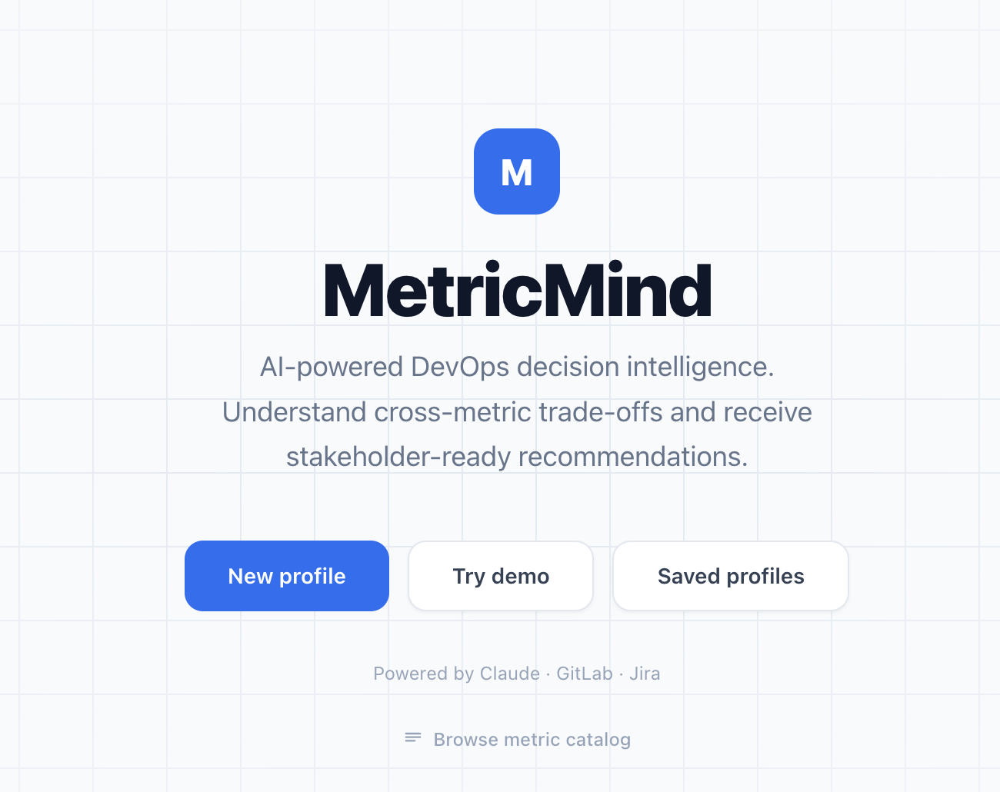

# MetricMind



MetricMind is an AI-powered engineering intelligence platform that analyses software repositories and generates contextual insights about team health, delivery performance, and sustainability. It combines DORA metrics with LLM-driven reasoning to produce stakeholder-tailored reports.

## Features

- **Repository analysis** — connects to GitHub and GitLab to ingest commits, merge requests, and pipeline data
- **Metric computation** — calculates DORA metrics (Deployment Frequency, Change Failure Rate, MTTR, Lead Time) plus sustainability indicators (Burnout Risk, After-Hours Commit Rate)
- **AI-powered reasoning** — multi-step LLM pipeline interprets metrics in context and generates plain-language explanations
- **Profile-driven selection** — metric selection adapts to the team's primary goal, decision type, and business criticality
- **Multi-stakeholder reporting** — explanations tailored to engineering, management, or executive audiences
- **Trend visualisation** — historical metric trends with period comparisons

## Tech Stack

| Layer | Technology |
|---|---|
| Backend | FastAPI, SQLAlchemy, SQLite |
| Frontend | Next.js 14 (App Router), TypeScript, Tailwind CSS |
| AI | Anthropic Claude / Google Gemini / OpenAI (configurable) |
| Ingestion | GitHub REST API, GitLab REST API |
| Deployment | Docker Compose |

## Getting Started

### Prerequisites

- Docker and Docker Compose
- A GitHub or GitLab Personal Access Token with `repo` / `read_api` scope
- An API key for at least one LLM provider (Anthropic, Gemini, or OpenAI)

### Setup

1. Clone the repository:
   ```bash
   git clone https://github.com/elsirleem/metricmind.git
   cd metricmind
   ```

2. Create a `.env` file in the project root:
   ```env
   # LLM Provider — choose one: anthropic | gemini | openai
   LLM_PROVIDER=anthropic
   ANTHROPIC_API_KEY=your_anthropic_key

   # GOOGLE_API_KEY=your_gemini_key
   # OPENAI_API_KEY=your_openai_key

   # Git providers
   GITHUB_TOKEN=your_github_pat
   GITLAB_TOKEN=your_gitlab_pat
   GITLAB_URL=https://gitlab.com
   ```

3. Start the application:
   ```bash
   docker compose up --build
   ```

4. Open [http://localhost:3000](http://localhost:3000) in your browser.

## Usage

1. **Explore** — enter your repository URL and an optional time window (30 / 60 / 90 days or custom date). MetricMind fetches commits and merge requests to profile the project.
2. **Describe** — answer a few questions about your team's goals and context. The AI pre-fills answers from what it found in the repository.
3. **Configure** — review the recommended metric set and adjust your profile (primary goal, decision type, stakeholder role, business criticality).
4. **Generate report** — receive a full intelligence report with metric assessments, sustainability analysis, and recommended actions.
5. **Trends** — view historical metric trends across configurable time windows.

## Metrics

### DORA Metrics
| Code | Name |
|---|---|
| DF | Deployment Frequency |
| CFR | Change Failure Rate |
| MTTR | Mean Time to Recovery |
| LTfC | Lead Time for Changes |

### Sustainability Indicators
| Code | Name |
|---|---|
| BUR | Burnout Risk |
| AHCR | After-Hours Commit Rate |
| MIC | Manual Intervention Count |
| BF | Build Fragility |

## Environment Variables

| Variable | Description |
|---|---|
| `LLM_PROVIDER` | `anthropic`, `gemini`, or `openai` |
| `ANTHROPIC_API_KEY` | Anthropic API key |
| `GOOGLE_API_KEY` | Google Gemini API key |
| `OPENAI_API_KEY` | OpenAI API key |
| `GITHUB_TOKEN` | GitHub Personal Access Token |
| `GITLAB_TOKEN` | GitLab Personal Access Token |
| `GITLAB_URL` | GitLab instance URL (default: `https://gitlab.com`) |
| `DATABASE_URL` | SQLAlchemy DB URL (set automatically in Docker) |

## Project Structure

```
metricmind/
├── backend/
│   ├── ingestion/       # GitHub & GitLab adapters
│   ├── metrics/         # Metric computation, selection, catalog
│   ├── pipeline/        # LLM pipeline calls (explore, interpret, reason, explain)
│   ├── routers/         # FastAPI route handlers
│   └── db/              # SQLAlchemy models and session
├── frontend/
│   ├── app/             # Next.js App Router pages
│   ├── components/      # React components (ProfileWizard, Trends, etc.)
│   └── lib/             # API client
├── docker-compose.yml
├── Dockerfile.backend
└── requirements.txt
```

## License

MIT
